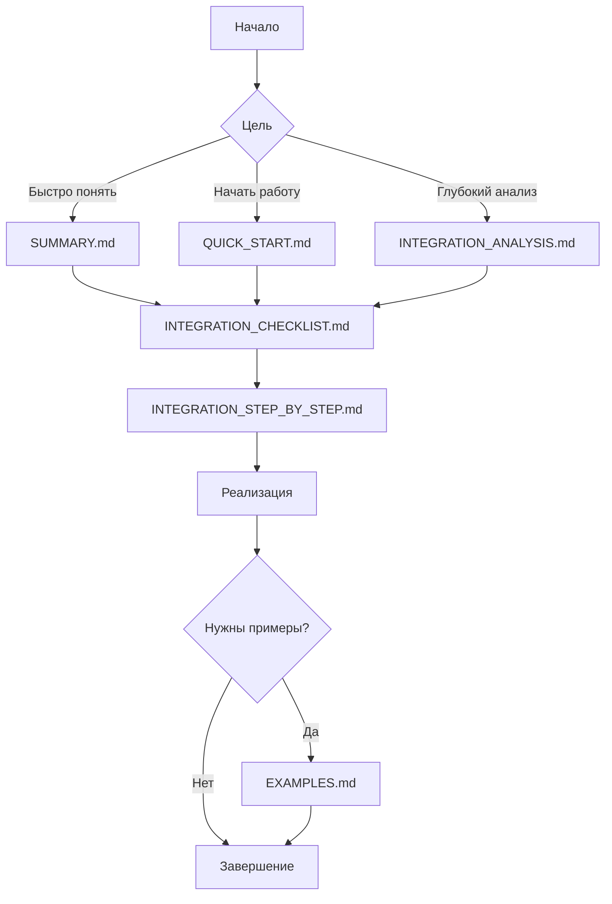

# 🚀 Интеграция hh.ru - Главная страница

> **Статус**: ✅ Готово к реализации  
> **Дата**: 28 января 2026  
> **Версия**: 1.0

---

## 📌 Что это?

Этот проект добавляет поддержку **международного поиска вакансий** (через hh.ru) в существующую систему парсинга **локальных молдавских сайтов**.

## 🎯 Зачем это нужно?

### Текущая ситуация
- ✅ Парсинг локальных сайтов: rabota.md, 999.md, makler.md
- ❌ Нет поддержки международных площадок
- ❌ Пользователи не могут искать работу за рубежом

### После интеграции
- ✅ Все текущие функции сохраняются
- ✅ Добавляется поиск на hh.ru (Россия)
- ✅ Автоматическое определение стратегии поиска
- ✅ Расширенный охват рынка труда

## 🏗️ Архитектура решения

```
┌─────────────────────────────────────────────────────┐
│                  Единый интерфейс                    │
│              (стратегия поиска)                      │
└────────────────────┬────────────────────────────────┘
                     │
        ┌────────────┼────────────┐
        │            │            │
   ┌────▼────┐  ┌───▼────┐  ┌───▼────┐
   │  Локаль-│  │Междуна-│  │Гибрид- │
   │  ный    │  │родный  │  │ный     │
   │  поиск  │  │поиск   │  │поиск   │
   └────┬────┘  └───┬────┘  └───┬────┘
        │            │            │
   ┌────▼────┐  ┌───▼────┐  ┌───▼────┐
   │rabota.md│  │ hh.ru  │  │Все     │
   │999.md   │  │        │  │источники│
   │makler.md│  │        │  │        │
   └─────────┘  └────────┘  └────────┘
```

## 📚 Быстрый старт

### 1. Прочитай краткое резюме
👉 [**SUMMARY.md**](./SUMMARY.md) - 5 минут на понимание сути

### 2. Изучи план работ
👉 [**INTEGRATION_CHECKLIST.md**](./INTEGRATION_CHECKLIST.md) - чек-лист всех задач

### 3. Начни реализацию
👉 [**INTEGRATION_STEP_BY_STEP.md**](./INTEGRATION_STEP_BY_STEP.md) - пошаговое руководство

## 🗺️ Навигация по документации



## 📖 Полный список документов

| Документ | Описание | Время чтения |
|----------|----------|--------------|
| [**SUMMARY.md**](./SUMMARY.md) | ⭐ Краткое резюме и рекомендации | 5 мин |
| [**QUICK_START.md**](./QUICK_START.md) | 🚀 Быстрый старт | 15 мин |
| [**DOCUMENTATION_MAP.md**](./DOCUMENTATION_MAP.md) | 🗺️ Карта всей документации | 10 мин |
| [**README_INDEX.md**](./README_INDEX.md) | 📖 Оглавление | 5 мин |
| [**INTEGRATION_ANALYSIS.md**](./INTEGRATION_ANALYSIS.md) | 📊 Детальный анализ | 1-2 часа |
| [**FINAL_RECOMMENDATIONS.md**](./FINAL_RECOMMENDATIONS.md) | 💡 Итоговые рекомендации | 30 мин |
| [**INTEGRATION_STEP_BY_STEP.md**](./INTEGRATION_STEP_BY_STEP.md) | 🔧 Пошаговое руководство | 2-3 часа |
| [**INTEGRATION_CHECKLIST.md**](./INTEGRATION_CHECKLIST.md) | ✅ Чек-лист задач | 10 мин |
| [**EXAMPLES.md**](./EXAMPLES.md) | 📝 Примеры использования | 30 мин |

## 🎯 Ключевые особенности

### 1. Автоматическое определение стратегии

```bash
# Локальный поиск (по умолчанию)
npm run parse "программист" "программист"
# → парсит только молдавские сайты

# Международный поиск (автоопределение)
npm run parse "программист за рубежом" "программист"
# → парсит только hh.ru

# Гибридный поиск
npm run parse "программист" "программист" "hybrid"
# → парсит все источники
```

### 2. Рейт-лимитинг API

```typescript
// Автоматическое управление лимитами
// 100 запросов в минуту для hh.ru
private rateLimit = 100;
private async checkRateLimit() {
  // Автоматически ждет при превышении лимита
}
```

### 3. Унифицированный формат данных

```typescript
// Все вакансии имеют единый формат
interface Vacancy {
  id: string;
  title: string;
  company: string;
  salary: string;
  salaryFrom?: number;  // Новое
  salaryTo?: number;    // Новое
  salaryCurrency?: string; // Новое
  country?: string;     // Новое (Russia, Moldova)
  city?: string;        // Новое
  source: string;       // rabota.md, 999.md, makler.md, hh.ru
  // ... остальные поля
}
```

## ⏱️ Оценка времени

| Этап | Время | Статус |
|------|-------|--------|
| Подготовка | 1-2 дня | ⏳ Ожидает |
| Разработка | 3-5 дней | ⏳ Ожидает |
| Интеграция | 2 дня | ⏳ Ожидает |
| База данных | 1 день | ⏳ Ожидает |
| Тестирование | 2-3 дня | ⏳ Ожидает |
| Деплой | 1-2 дня | ⏳ Ожидает |
| **Итого** | **10-12 дней** | ⏳ Ожидает |

## 📊 Ожидаемые результаты

### Производительность
- **Локальный поиск**: ~2 минуты
- **Международный поиск**: ~5 минут
- **Гибридный поиск**: ~7 минут

### Покрытие
- **До**: Только Молдова (~3 сайта)
- **После**: Молдова + Россия (~4 сайта)
- **Рост охвата**: +100% (российский рынок)

### Качество данных
- ✅ Валидация и нормализация
- ✅ Унифицированный формат
- ✅ Поддержка актуальности
- ✅ Расширенные метаданные

## ⚠️ Важные замечания

### 1. Лимиты API hh.ru
- **100 запросов в минуту** - строгое ограничение
- **Решение**: Реализован рейт-лимитинг
- **Рекомендация**: Использовать кэширование

### 2. Обратная совместимость
- ✅ Все существующие функции работают
- ✅ Старые данные не затрагиваются
- ✅ Можно отключить международный поиск

### 3. Тестирование
- ⚠️ Обязательно тестировать каждый этап
- ⚠️ Проверять работу всех стратегий
- ⚠️ Мониторить рейт-лимиты

## 🚀 Следующие шаги

1. **Прочитай** [SUMMARY.md](./SUMMARY.md)
2. **Открой** [INTEGRATION_CHECKLIST.md](./INTEGRATION_CHECKLIST.md)
3. **Начни** с [INTEGRATION_STEP_BY_STEP.md](./INTEGRATION_STEP_BY_STEP.md)
4. **Тестируй** на каждом этапе
5. **Документируй** свои изменения

## 💬 Поддержка

### Если возникли вопросы:
1. Проверь [EXAMPLES.md](./EXAMPLES.md)
2. Перечитай соответствующий раздел документации
3. Посмотри исходный код примеров
4. Обратись к команде разработки

### Полезные ссылки:
- [API hh.ru Documentation](https://github.com/hhru/api)
- [Prisma Documentation](https://www.prisma.io/docs)
- [TypeScript Documentation](https://www.typescriptlang.org/docs/)

## 📝 История изменений

| Дата | Версия | Изменения |
|------|--------|-----------|
| 28.01.2026 | 1.0 | Создание документации |

## 📄 Лицензия

Документация является частью проекта Parsing.

---

## ✅ Готов начать?

1. ✅ Прочитал это руководство
2. ✅ Понял общую концепцию
3. ✅ Открыл чек-лист задач
4. ✅ Готов к реализации

**Тогда вперед!** 🚀

👉 **Первый шаг**: Открой [INTEGRATION_STEP_BY_STEP.md](./INTEGRATION_STEP_BY_STEP.md) и начни с шага 1.

---

**Последнее обновление**: 28 января 2026  
**Версия**: 1.0  
**Статус**: ✅ Готово к реализации
